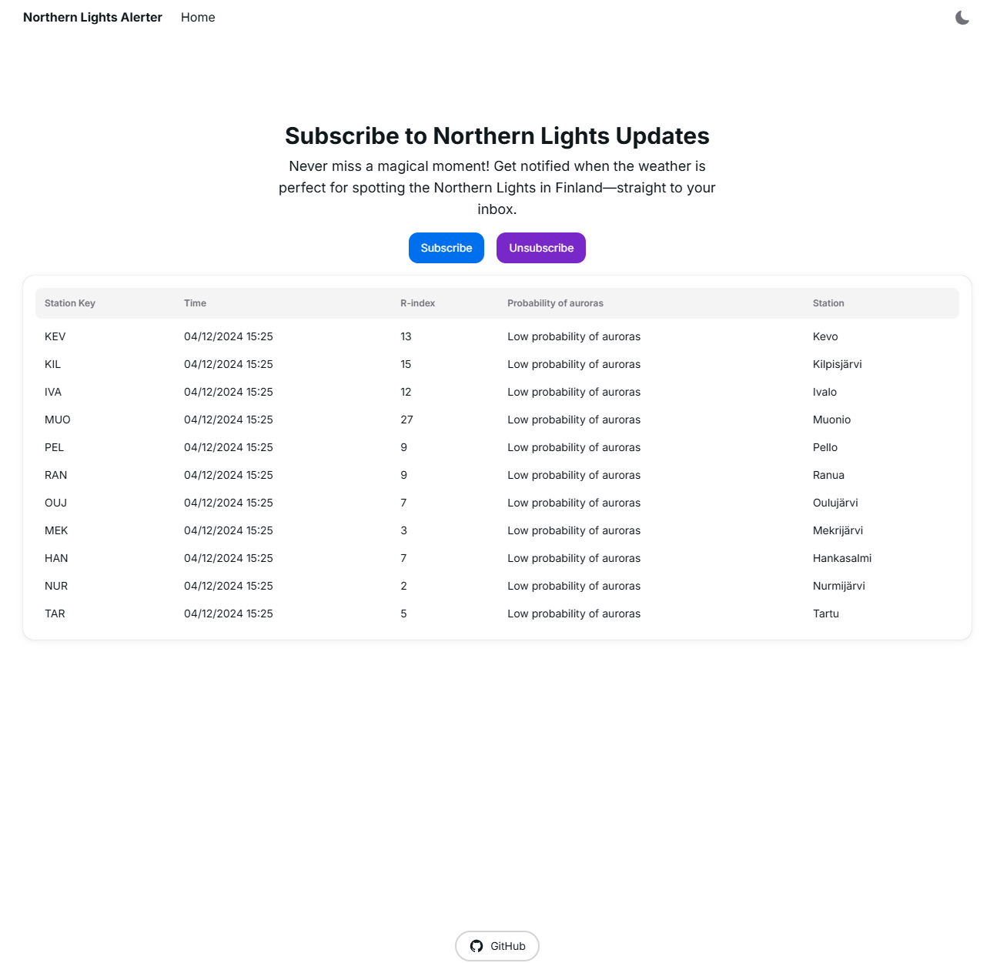
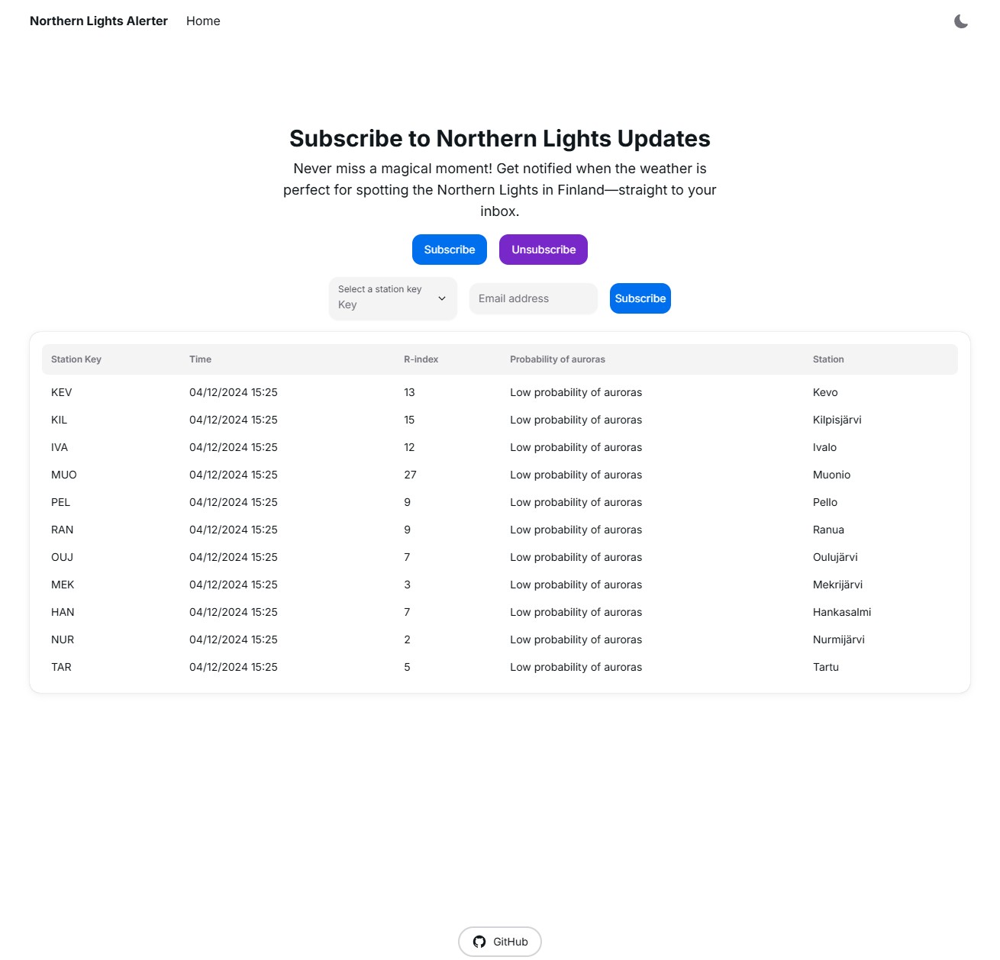
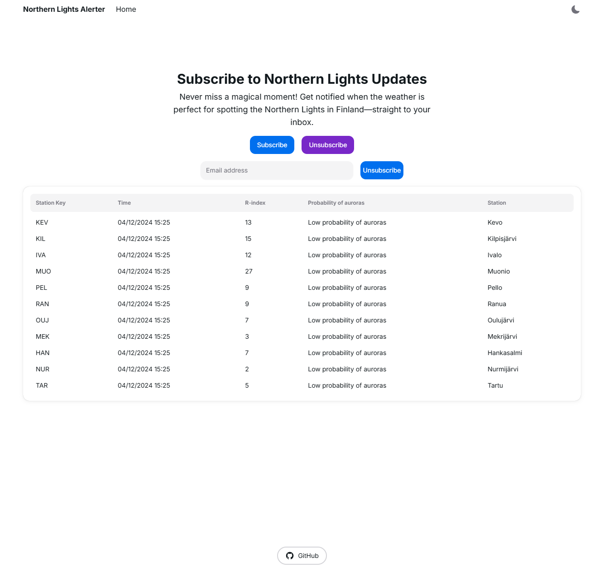

## Northern Lights Alerter

Northern Lights Alerter is an application that displays the current status of the northern lights (aurora borealis) in Finland using an external Finnish API. Users can subscribe and unsubscribe to alerts, receiving email notifications when the northern lights are visible. The application has been tested in production and is fully functional.

### Notification Flow

1. Users have the ability to subscribe and unsubscribe at any time.
2. A CRON job runs daily at 18:00*. If the conditions for northern lights visibility are met, an email notification is sent to subscribers. Each email address can receive notifications once every 12 hours.
3. A table displaying the current status of the northern lights is available on the front page and does not require a subscription.

*Note: The Vercel free plan allows running automatic CRON jobs only once per day. If you are on a different plan, you may want to adjust the `vercel.json` settings accordingly.

## Technologies Used

- Next.js
- Node.js
- React.js
- TypeScript
- NextUI v2
- Tailwind CSS
- Next-themes
- GitHub Actions
- External API integrations
- Nodemailer (Gmail integration)
- MongoDB
- Vercel (deployment)
- CRON job

## How to Use

### Install Dependencies

```bash
npm install
```

### Set Up Environment Variables

Configure the following environment variables either in a `.env.local` file or in the appropriate production environment:

- `NEXT_PUBLIC_BASE_URL`: Your base URL, e.g., "http://localhost:3000" for local development; varies in production.
- `EMAIL_USER`: The email address used for sending notifications, must have 2-factor authentication enabled (at least if using Gmail).
- `EMAIL_PASS`: The application-specific password for the email account. Not an actual email password.
- `MONGODB_URI`: Your MongoDB URI, set MongoDB locally or via Vercel (https://vercel.com/integrations/mongodbatlas).
- `CRON_SECRET`: The secret used for the CRON job in the email API; this could potentially be refactored out as there is logic to prevent spam.

### Run Locally

```bash
npm run dev
```

## Screenshot




## License

This project is licensed under the [MIT license](https://github.com/nextui-org/next-app-template/blob/main/LICENSE).
